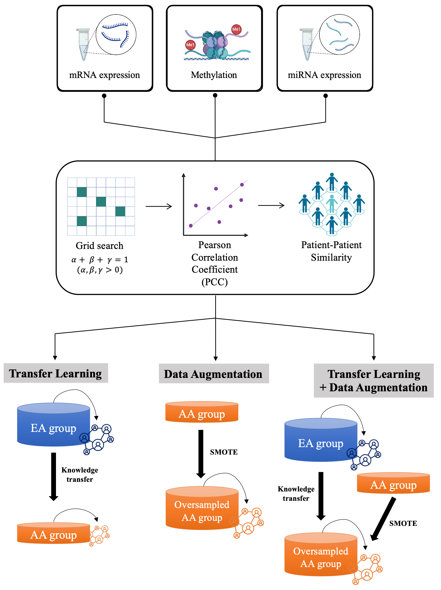

<h1><strong>MOTLAB</strong></h1>
<p>
  A <strong><ins>M</ins></strong>ulti-<strong><ins>O</ins></strong>mics
  <strong><ins>T</ins></strong>ransfer <strong><ins>L</ins></strong>earning with synthetic data 
  <strong><ins>A</ins></strong>ugmentation to reduce <strong><ins>B</ins></strong>reast cancer racial disparities
</p>

## Overview
**Racial disparities in breast cancer** outcomes remain a major public health concern, particularly for African American women, who exhibit significantly higher mortality rates compared to their European American counterparts. A key contributing factor is the underrepresentation of racially diverse populations in cancer genomics datasets, which hinders the generalizability of machine learning (ML) models. To address this issue, we propose **a weighted multimodal framework** that incorporates **transfer learning and interpolation-based data augmentation via SMOTE**. Utilizing mRNA, miRNA, and DNA methylation data from The Cancer Genome Atlas (TCGA), the model is pretrained on European American samples and fine-tuned on African American data. SMOTE is applied to enhance minority class representation, and omics-aware weighting is employed to optimize multi-omics integration. Experimental results show that this combined strategy substantially improves predictive performance for the African American cohort, offering a promising approach for mitigating performance gaps in cancer prognosis modeling.

<p align="center">
  
</p>

## Table of Contents
- [Requirements](#requirements)
- [Installation](#installation)
- [Instructions](#instructions)
- [Troubleshooting](#troubleshooting)

## Requirements
This model requires following python packages. 

| Packages         | Version                       |
|--------------------|----------------------------|
| numpy              | 1.21.6                     |
| pandas             | 1.3.5                      |
| tensorflow         | 2.11.0                     |
| keras              | 2.11.0                     |
| theano             | 1.0.5                      |
| scikit-learn       | 1.2.2                      |
| imbalanced-learn   | 0.10.1                     |
| scipy              | 1.10.1                     |

## Installation
1. Clone the _**MOTLAB**_ git repository
```bash
git clone https://github.com/wan-mlab/MOTLAB.git
```
2. Navigate to the directory of _**MOTLAB**_ package
```bash
cd /your_path/MOTLAB
```

## Instructions

```
usage: run_MOTLAB.py [-h] --in_path IN_PATH --out_path OUT_PATH --cpoint CPOINT --year YEAR

This script implements a fairness-aware deep learning model designed to mitigate
racial disparities in breast cancer prognosis. It integrates transfer learning and
synthetic data augmentation (SMOTE) with weighted multi-omics representation to
improve predictive performance in underrepresented populations. The model is
pretrained on European American data and fine-tuned on African American data using
contrastive domain adaptation.

optional arguments:
  -h, --help            show this help message and exit
  --in_path IN_PATH     Path to the input multi-omics data and other materials
                        for model training.
  --out_path OUT_PATH   Path for all output files after model training.
  --cpoint CPOINT       Clinical endpoint of interest for prognosis prediction
                        (e.g., PFI, DSS).
  --year YEAR           Time threshold used to define positive prognosis events.
```

## Example  

```
python run_MOTLAB.py \
      --in_path /home/user/project/input \
      --out_path /home/user/project/output \
      --cpoint PFI \
      --year 3
```

## Troubleshooting 

We kindly ask users and contributors to utilize the Issues section of this repository for reporting bugs, requesting new features, or documenting any technical difficulties encountered during usage. We monitor submitted issues regularly and will do our best to respond in a timely and constructive manner. 

## Citation (To update)
*“Title of the Paper: A Study using Transfer Learning”*  
_Author1, Author2, et al. (Year)_
